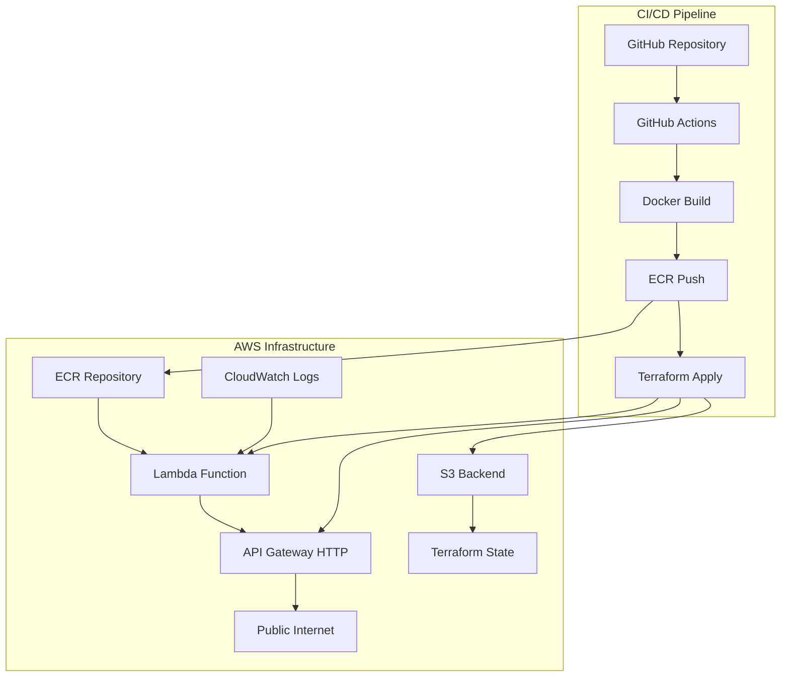

# Documento de Design

## Visão Geral

Esta solução implementa uma aplicação serverless completa na AWS usando Lambda containerizada, API Gateway, ECR, e Terraform para Infrastructure as Code. A arquitetura demonstra práticas modernas de DevOps com CI/CD automatizado, containerização, e provisionamento de infraestrutura reproduzível.

A aplicação consiste em uma API Python simples usando Flask, empacotada em container Docker, publicada no Amazon ECR, e deployada como função Lambda integrada com API Gateway HTTP. Todo o processo é automatizado através de pipeline CI/CD usando GitHub Actions.

## Arquitetura

### Componentes Principais



### Fluxo de Dados

1. **Desenvolvimento**: Código commitado no repositório GitHub
2. **CI/CD**: GitHub Actions automaticamente constrói, testa e deploya
3. **Build**: Docker image é construída com a aplicação Python
4. **Registry**: Image é enviada para Amazon ECR
5. **Infrastructure**: Terraform provisiona Lambda e API Gateway
6. **Runtime**: Requisições HTTP são roteadas via API Gateway para Lambda
7. **Monitoring**: Logs são coletados no CloudWatch

## Componentes e Interfaces

### 1. Aplicação Python (Flask)

**Responsabilidades:**
- Servir endpoints HTTP `/hello` e `/echo`
- Processar requisições e retornar respostas JSON
- Logging estruturado para observabilidade
- Tratamento de erros e validação de entrada

**Interface:**
```python
# Endpoints da API
GET /hello -> {"message": "Hello World"}
GET /echo?msg=teste -> {"message": "teste"}
GET /echo (sem parâmetro) -> {"error": "Parameter 'msg' is required"}
```

**Estrutura do Projeto:**
```
src/
├── app.py              # Aplicação Flask principal
├── requirements.txt    # Dependências Python
└── lambda_function.py  # Handler para AWS Lambda
```

### 2. Container Docker

**Responsabilidades:**
- Empacotar aplicação Python com dependências
- Configurar runtime compatível com AWS Lambda
- Otimizar tamanho da imagem para performance
- Implementar security best practices

**Dockerfile Strategy:**
- Base image: `public.ecr.aws/lambda/python:3.11`
- Multi-stage build para otimização
- Non-root user para segurança
- Health check para validação

### 3. Amazon ECR Repository

**Responsabilidades:**
- Armazenar imagens Docker de forma segura
- Versionamento de imagens com tags
- Lifecycle policies para gerenciamento de storage
- Scan de vulnerabilidades automático

**Configuração:**
- Image tag mutability: MUTABLE para desenvolvimento
- Scan on push: habilitado
- Lifecycle policy: manter últimas 10 imagens

### 4. AWS Lambda Function

**Responsabilidades:**
- Executar aplicação containerizada
- Escalar automaticamente baseado na demanda
- Integrar com API Gateway
- Logging e monitoring

**Configuração:**
- Package type: Image
- Memory: 512 MB
- Timeout: 30 segundos
- Architecture: x86_64
- Environment variables para configuração

### 5. API Gateway HTTP API

**Responsabilidades:**
- Expor endpoints HTTP publicamente
- Rotear requisições para Lambda
- Gerenciar throttling e rate limiting
- CORS configuration para web clients

**Configuração:**
- Protocol type: HTTP
- Integration type: AWS_PROXY
- CORS: habilitado para desenvolvimento
- Stage: $default com auto-deploy

### 6. Terraform Infrastructure

**Responsabilidades:**
- Provisionar todos os recursos AWS
- Gerenciar estado da infraestrutura
- Outputs para informações importantes
- Destroy clean para cleanup

**Módulos:**
```
terraform/
├── main.tf           # Recursos principais
├── variables.tf      # Variáveis de entrada
├── outputs.tf        # Outputs da infraestrutura
├── versions.tf       # Provider versions
└── backend.tf        # S3 backend configuration
```

### 7. CI/CD Pipeline (GitHub Actions)

**Responsabilidades:**
- Trigger automático em push/PR
- Build e test da aplicação
- Docker build e push para ECR
- Terraform plan e apply
- Notificações de status

**Workflow Steps:**
1. Checkout código
2. Setup Python e dependências
3. Lint e test do código
4. Configure AWS credentials
5. Build Docker image
6. Push para ECR
7. Terraform init/plan/apply
8. Output da URL da API

## Modelos de Dados

### Request/Response Models

```python
# Hello Endpoint Response
{
    "message": "Hello World",
    "timestamp": "2024-01-01T12:00:00Z",
    "version": "1.0.0"
}

# Echo Endpoint Response (Success)
{
    "message": "user_input_message",
    "echo": true,
    "timestamp": "2024-01-01T12:00:00Z"
}

# Error Response
{
    "error": "Parameter 'msg' is required",
    "status_code": 400,
    "timestamp": "2024-01-01T12:00:00Z"
}
```

### Environment Variables

```python
# Lambda Environment Variables
{
    "LOG_LEVEL": "INFO",
    "ENVIRONMENT": "production",
    "API_VERSION": "1.0.0"
}
```

### Terraform Variables

```hcl
# terraform/variables.tf
variable "project_name" {
  description = "Nome do projeto"
  type        = string
  default     = "lambda-container-api"
}

variable "environment" {
  description = "Ambiente de deployment"
  type        = string
  default     = "dev"
}

variable "aws_region" {
  description = "Região AWS"
  type        = string
  default     = "us-east-1"
}
```

## Tratamento de Erros

### Níveis de Tratamento

1. **Aplicação Level**:
   - Validação de parâmetros de entrada
   - Try/catch para operações críticas
   - Logging estruturado de erros
   - HTTP status codes apropriados

2. **Lambda Level**:
   - Dead letter queue para falhas
   - Retry configuration
   - Timeout handling
   - Memory/resource monitoring

3. **API Gateway Level**:
   - Rate limiting
   - Request validation
   - CORS error handling
   - 5xx error responses

4. **Infrastructure Level**:
   - Terraform state locking
   - Resource dependency management
   - Rollback strategies
   - Health checks

### Error Response Format

```python
{
    "error": "Detailed error message",
    "error_code": "VALIDATION_ERROR",
    "status_code": 400,
    "timestamp": "2024-01-01T12:00:00Z",
    "request_id": "lambda-request-id"
}
```

## Estratégia de Testes

### 1. Testes Unitários
- **Framework**: pytest
- **Coverage**: >90% code coverage
- **Scope**: Funções individuais, validação de entrada, lógica de negócio

### 2. Testes de Integração
- **Framework**: pytest + requests
- **Scope**: Endpoints da API, integração Flask
- **Environment**: Local development server

### 3. Testes de Container
- **Framework**: Docker + curl
- **Scope**: Container functionality, port exposure
- **Validation**: Health checks, response validation

### 4. Testes de Infraestrutura
- **Framework**: Terraform validate + plan
- **Scope**: Resource configuration, dependencies
- **Validation**: Syntax, resource relationships

### 5. Testes End-to-End
- **Framework**: GitHub Actions + curl
- **Scope**: Deployed API functionality
- **Environment**: AWS deployed infrastructure

### Test Structure

```
tests/
├── unit/
│   ├── test_app.py
│   └── test_lambda_handler.py
├── integration/
│   └── test_api_endpoints.py
├── container/
│   └── test_docker_functionality.py
└── e2e/
    └── test_deployed_api.py
```

## Segurança

### 1. Container Security
- Base image oficial AWS Lambda
- Non-root user execution
- Minimal dependencies
- Vulnerability scanning no ECR

### 2. AWS Security
- IAM roles com least privilege
- VPC configuration (opcional)
- Encryption at rest (ECR, S3)
- CloudTrail logging

### 3. API Security
- CORS configuration
- Rate limiting
- Input validation
- HTTPS only

### 4. CI/CD Security
- GitHub secrets para credentials
- OIDC para AWS authentication
- Dependency scanning
- Code quality gates

## Performance e Escalabilidade

### Lambda Configuration
- **Memory**: 512 MB (otimizado para custo/performance)
- **Timeout**: 30 segundos
- **Concurrent executions**: 1000 (default)
- **Cold start**: ~2-3 segundos para container

### API Gateway Limits
- **Throttling**: 10,000 requests/second
- **Burst**: 5,000 requests
- **Payload**: 10 MB max
- **Timeout**: 30 segundos

### Monitoring Metrics
- Lambda duration, errors, throttles
- API Gateway 4xx/5xx errors, latency
- ECR image pull metrics
- CloudWatch custom metrics

## Deployment Strategy

### Environments
1. **Development**: Feature branches, ephemeral infrastructure
2. **Staging**: Main branch, persistent infrastructure
3. **Production**: Tagged releases, blue/green deployment

### Rollback Strategy
- Terraform state backup
- ECR image versioning
- Lambda alias/versions
- API Gateway stage management

### Zero-Downtime Deployment
- Lambda versioning com aliases
- API Gateway stage promotion
- Health checks antes da promoção
- Automatic rollback em falhas