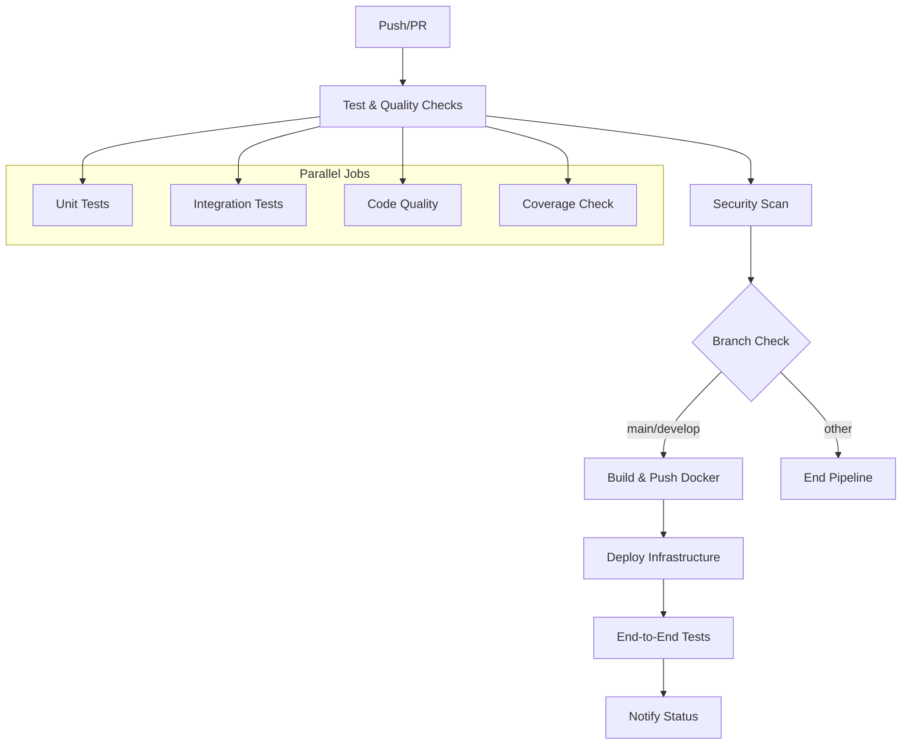

# Documentação do Pipeline CI/CD - AWS Lambda Container API

Este documento explica o funcionamento do pipeline automatizado de CI/CD, configuração de secrets do GitHub, e guias de monitoramento e debugging.

## 📋 Índice

- [Visão Geral do Pipeline](#-visão-geral-do-pipeline)
- [Configuração de Secrets](#-configuração-de-secrets)
- [Workflow Detalhado](#-workflow-detalhado)
- [Triggers e Condições](#-triggers-e-condições)
- [Monitoramento do Pipeline](#-monitoramento-do-pipeline)
- [Debugging e Troubleshooting](#-debugging-e-troubleshooting)
- [Otimização e Performance](#-otimização-e-performance)
- [Segurança](#-segurança)

## 🔄 Visão Geral do Pipeline

### Arquitetura do Pipeline



### Jobs do Pipeline

1. **test**: Testes e verificações de qualidade
2. **security-scan**: Análise de segurança
3. **build-and-push**: Build e push da imagem Docker
4. **deploy**: Deploy da infraestrutura Terraform
5. **e2e-test**: Testes end-to-end
6. **notify**: Notificações de status

### Tempo de Execução

- **Testes**: ~3-5 minutos
- **Security Scan**: ~2-3 minutos
- **Build & Push**: ~5-8 minutos
- **Deploy**: ~3-5 minutos
- **E2E Tests**: ~1-2 minutos
- **Total**: ~15-25 minutos

## 🔐 Configuração de Secrets

### Secrets Obrigatórios

Configure os seguintes secrets no GitHub (Settings > Secrets and variables > Actions):

#### 1. AWS_ROLE_TO_ASSUME (Recomendado - OIDC)

```bash
# ARN da role IAM para GitHub Actions
AWS_ROLE_TO_ASSUME=arn:aws:iam::123456789012:role/GitHubActionsRole
```

**Criação da Role OIDC:**

```bash
# 1. Criar OIDC Identity Provider (uma vez por conta AWS)
aws iam create-open-id-connect-provider \
  --url https://token.actions.githubusercontent.com \
  --client-id-list sts.amazonaws.com \
  --thumbprint-list 6938fd4d98bab03faadb97b34396831e3780aea1

# 2. Criar role para GitHub Actions
aws iam create-role \
  --role-name GitHubActionsRole \
  --assume-role-policy-document '{
    "Version": "2012-10-17",
    "Statement": [
      {
        "Effect": "Allow",
        "Principal": {
          "Federated": "arn:aws:iam::123456789012:oidc-provider/token.actions.githubusercontent.com"
        },
        "Action": "sts:AssumeRoleWithWebIdentity",
        "Condition": {
          "StringEquals": {
            "token.actions.githubusercontent.com:aud": "sts.amazonaws.com"
          },
          "StringLike": {
            "token.actions.githubusercontent.com:sub": "repo:seu-usuario/seu-repositorio:*"
          }
        }
      }
    ]
  }'

# 3. Anexar políticas necessárias
aws iam attach-role-policy \
  --role-name GitHubActionsRole \
  --policy-arn arn:aws:iam::aws:policy/AmazonEC2ContainerRegistryFullAccess

aws iam attach-role-policy \
  --role-name GitHubActionsRole \
  --policy-arn arn:aws:iam::aws:policy/AWSLambda_FullAccess

aws iam attach-role-policy \
  --role-name GitHubActionsRole \
  --policy-arn arn:aws:iam::aws:policy/AmazonAPIGatewayAdministrator

# 4. Criar política customizada para Terraform
aws iam create-policy \
  --policy-name TerraformStateAccess \
  --policy-document '{
    "Version": "2012-10-17",
    "Statement": [
      {
        "Effect": "Allow",
        "Action": [
          "s3:GetObject",
          "s3:PutObject",
          "s3:DeleteObject",
          "s3:ListBucket"
        ],
        "Resource": [
          "arn:aws:s3:::seu-bucket-terraform-state",
          "arn:aws:s3:::seu-bucket-terraform-state/*"
        ]
      },
      {
        "Effect": "Allow",
        "Action": [
          "dynamodb:GetItem",
          "dynamodb:PutItem",
          "dynamodb:DeleteItem"
        ],
        "Resource": "arn:aws:dynamodb:us-east-1:123456789012:table/terraform-state-lock"
      }
    ]
  }'

aws iam attach-role-policy \
  --role-name GitHubActionsRole \
  --policy-arn arn:aws:iam::123456789012:policy/TerraformStateAccess
```

#### 2. TERRAFORM_STATE_BUCKET

```bash
# Nome do bucket S3 para estado do Terraform
TERRAFORM_STATE_BUCKET=seu-bucket-terraform-state
```

### Secrets Opcionais

#### AWS Credentials (Alternativa ao OIDC)

```bash
# Se não usar OIDC, configure credenciais diretas
AWS_ACCESS_KEY_ID=AKIA...
AWS_SECRET_ACCESS_KEY=...
```

#### Notificações

```bash
# Para notificações Slack (opcional)
SLACK_WEBHOOK_URL=https://hooks.slack.com/services/...

# Para notificações Discord (opcional)
DISCORD_WEBHOOK_URL=https://discord.com/api/webhooks/...
```

### Variáveis de Ambiente

Configure as seguintes variáveis (Settings > Secrets and variables > Actions > Variables):

```bash
# Configurações AWS
AWS_REGION=us-east-1
ECR_REPOSITORY=lambda-container-api
TERRAFORM_VERSION=1.5.0

# Configurações do projeto
PROJECT_NAME=lambda-container-api
ENVIRONMENT_DEV=dev
ENVIRONMENT_PROD=prod
```

## 🔧 Workflow Detalhado

### Arquivo de Configuração

O pipeline está definido em `.github/workflows/ci-cd.yml`:

```yaml
name: CI/CD Pipeline

on:
  push:
    branches: [ main, develop ]
  pull_request:
    branches: [ main, develop ]

env:
  AWS_REGION: us-east-1
  ECR_REPOSITORY: lambda-container-api
  TERRAFORM_VERSION: 1.5.0
```

### Job 1: Test and Quality Checks

```yaml
jobs:
  test:
    name: Test and Quality Checks
    runs-on: ubuntu-latest
    
    steps:
    - name: Checkout code
      uses: actions/checkout@v4
      
    - name: Set up Python 3.11
      uses: actions/setup-python@v4
      with:
        python-version: '3.11'
        
    - name: Cache pip dependencies
      uses: actions/cache@v3
      with:
        path: ~/.cache/pip
        key: ${{ runner.os }}-pip-${{ hashFiles('requirements-dev.txt') }}
        
    - name: Install dependencies
      run: |
        python -m pip install --upgrade pip
        pip install -r requirements-dev.txt
        
    - name: Code formatting check (Black)
      run: black --check --diff src/ tests/
      
    - name: Import sorting check (isort)
      run: isort --check-only --diff src/ tests/
      
    - name: Lint with flake8
      run: |
        flake8 src/ tests/ --count --select=E9,F63,F7,F82 --show-source --statistics
        flake8 src/ tests/ --count --exit-zero --max-complexity=10 --max-line-length=127 --statistics
        
    - name: Run unit tests with coverage
      run: pytest tests/unit/ --cov=src --cov-report=xml --cov-report=term-missing
      
    - name: Run integration tests
      run: pytest tests/integration/ -v
      
    - name: Upload coverage reports
      uses: codecov/codecov-action@v3
      with:
        file: ./coverage.xml
        flags: unittests
        name: codecov-umbrella
        fail_ci_if_error: false
```

**Verificações Realizadas:**
- ✅ Formatação de código (Black)
- ✅ Organização de imports (isort)
- ✅ Linting (flake8)
- ✅ Testes unitários
- ✅ Testes de integração
- ✅ Coverage reporting

### Job 2: Security Scanning

```yaml
  security-scan:
    name: Security Scanning
    runs-on: ubuntu-latest
    needs: test
    
    steps:
    - name: Checkout code
      uses: actions/checkout@v4
      
    - name: Set up Python 3.11
      uses: actions/setup-python@v4
      with:
        python-version: '3.11'
        
    - name: Install dependencies
      run: |
        python -m pip install --upgrade pip
        pip install -r requirements-dev.txt
        
    - name: Run safety check for vulnerabilities
      run: safety check --json || true
      
    - name: Run bandit security linter
      run: bandit -r src/ -f json || true
```

**Verificações de Segurança:**
- 🔒 Vulnerabilidades em dependências (Safety)
- 🔒 Análise de código para problemas de segurança (Bandit)

### Job 3: Build and Push Docker Image

```yaml
  build-and-push:
    name: Build and Push Docker Image
    runs-on: ubuntu-latest
    needs: [test, security-scan]
    if: github.ref == 'refs/heads/main' || github.ref == 'refs/heads/develop'
    
    permissions:
      id-token: write
      contents: read
    
    outputs:
      image-uri: ${{ steps.build-image.outputs.image }}
      image-tag: ${{ steps.meta.outputs.tags }}
    
    steps:
    - name: Checkout code
      uses: actions/checkout@v4
      
    - name: Configure AWS credentials using OIDC
      uses: aws-actions/configure-aws-credentials@v4
      with:
        role-to-assume: ${{ secrets.AWS_ROLE_TO_ASSUME }}
        aws-region: ${{ env.AWS_REGION }}
        
    - name: Login to Amazon ECR
      id: login-ecr
      uses: aws-actions/amazon-ecr-login@v2
      
    - name: Extract metadata for Docker
      id: meta
      uses: docker/metadata-action@v5
      with:
        images: ${{ steps.login-ecr.outputs.registry }}/${{ env.ECR_REPOSITORY }}
        tags: |
          type=ref,event=branch
          type=ref,event=pr
          type=sha,prefix={{branch}}-
          type=raw,value=latest,enable={{is_default_branch}}
          
    - name: Set up Docker Buildx
      uses: docker/setup-buildx-action@v3
      
    - name: Build and push Docker image
      id: build-image
      uses: docker/build-push-action@v5
      with:
        context: .
        push: true
        tags: ${{ steps.meta.outputs.tags }}
        labels: ${{ steps.meta.outputs.labels }}
        cache-from: type=gha
        cache-to: type=gha,mode=max
        platforms: linux/amd64
```

**Funcionalidades:**
- 🐳 Build otimizado com cache
- 🏷️ Tagging automático baseado em branch/commit
- 📦 Push para Amazon ECR
- 🔐 Autenticação via OIDC

### Job 4: Deploy Infrastructure

```yaml
  deploy:
    name: Deploy Infrastructure
    runs-on: ubuntu-latest
    needs: build-and-push
    if: github.ref == 'refs/heads/main' || github.ref == 'refs/heads/develop'
    
    permissions:
      id-token: write
      contents: read
    
    outputs:
      api-url: ${{ steps.terraform-output.outputs.api_url }}
      lambda-function-name: ${{ steps.terraform-output.outputs.lambda_function_name }}
    
    steps:
    - name: Checkout code
      uses: actions/checkout@v4
      
    - name: Configure AWS credentials using OIDC
      uses: aws-actions/configure-aws-credentials@v4
      with:
        role-to-assume: ${{ secrets.AWS_ROLE_TO_ASSUME }}
        aws-region: ${{ env.AWS_REGION }}
        
    - name: Setup Terraform
      uses: hashicorp/setup-terraform@v3
      with:
        terraform_version: ${{ env.TERRAFORM_VERSION }}
        terraform_wrapper: false
        
    - name: Terraform Format Check
      run: terraform fmt -check -recursive
      working-directory: terraform
      continue-on-error: true
      
    - name: Terraform Init
      run: |
        terraform init \
          -backend-config="bucket=${{ secrets.TERRAFORM_STATE_BUCKET }}" \
          -backend-config="key=${{ github.repository }}/terraform.tfstate" \
          -backend-config="region=${{ env.AWS_REGION }}"
      working-directory: terraform
      
    - name: Terraform Validate
      run: terraform validate -no-color
      working-directory: terraform
      
    - name: Terraform Plan
      run: |
        terraform plan -no-color -input=false \
          -var="image_uri=${{ needs.build-and-push.outputs.image-uri }}" \
          -var="environment=${{ github.ref == 'refs/heads/main' && 'prod' || 'dev' }}" \
          -out=tfplan
      working-directory: terraform
      
    - name: Terraform Apply
      run: terraform apply -auto-approve tfplan
      working-directory: terraform
```

**Funcionalidades:**
- 🏗️ Provisionamento automático de infraestrutura
- 📋 Validação e planejamento
- 🔄 Estado remoto no S3
- 🎯 Deploy baseado em branch (dev/prod)

### Job 5: End-to-End Tests

```yaml
  e2e-test:
    name: End-to-End Testing
    runs-on: ubuntu-latest
    needs: deploy
    if: github.ref == 'refs/heads/main' || github.ref == 'refs/heads/develop'
    
    steps:
    - name: Checkout code
      uses: actions/checkout@v4
      
    - name: Wait for API to be ready
      run: sleep 30
      
    - name: Test Hello endpoint
      run: |
        API_URL="${{ needs.deploy.outputs.api-url }}"
        response=$(curl -s -w "%{http_code}" -o response.json "${API_URL}/hello")
        http_code=${response: -3}
        
        if [ "$http_code" != "200" ]; then
          echo "Hello endpoint failed with HTTP code: $http_code"
          cat response.json
          exit 1
        fi
        
    - name: Test Echo endpoint
      run: |
        API_URL="${{ needs.deploy.outputs.api-url }}"
        response=$(curl -s -w "%{http_code}" -o response.json "${API_URL}/echo?msg=test")
        http_code=${response: -3}
        
        if [ "$http_code" != "200" ]; then
          echo "Echo endpoint failed with HTTP code: $http_code"
          exit 1
        fi
```

**Validações:**
- 🧪 Teste de endpoints deployados
- ⏱️ Verificação de tempo de resposta
- 🔍 Validação de error handling

## 🎯 Triggers e Condições

### Triggers Automáticos

#### Push Events

```yaml
on:
  push:
    branches: [ main, develop ]
```

**Comportamento:**
- **main**: Deploy para produção
- **develop**: Deploy para desenvolvimento
- **outras branches**: Apenas testes

#### Pull Request Events

```yaml
on:
  pull_request:
    branches: [ main, develop ]
```

**Comportamento:**
- Executa testes e verificações
- Não faz deploy
- Adiciona comentário com resultado do Terraform plan

### Condições de Execução

#### Deploy Condicional

```yaml
if: github.ref == 'refs/heads/main' || github.ref == 'refs/heads/develop'
```

#### Environment Selection

```yaml
environment: ${{ github.ref == 'refs/heads/main' && 'prod' || 'dev' }}
```

#### Job Dependencies

```yaml
needs: [test, security-scan]
```

### Triggers Manuais

Para executar o pipeline manualmente:

```yaml
on:
  workflow_dispatch:
    inputs:
      environment:
        description: 'Environment to deploy'
        required: true
        default: 'dev'
        type: choice
        options:
        - dev
        - prod
      skip_tests:
        description: 'Skip tests'
        required: false
        default: false
        type: boolean
```

## 📊 Monitoramento do Pipeline

### GitHub Actions Dashboard

1. **Acesse** o repositório no GitHub
2. **Clique** na aba "Actions"
3. **Selecione** o workflow "CI/CD Pipeline"
4. **Monitore** o status de cada job

### Status Badges

Adicione badges ao README para monitoramento visual:

```markdown


```

### Notificações

#### Slack Integration

```yaml
- name: Notify Slack
  if: always()
  uses: 8398a7/action-slack@v3
  with:
    status: ${{ job.status }}
    webhook_url: ${{ secrets.SLACK_WEBHOOK_URL }}
    text: |
      Pipeline ${{ job.status }} for ${{ github.repository }}
      Branch: ${{ github.ref_name }}
      Commit: ${{ github.sha }}
      API URL: ${{ needs.deploy.outputs.api-url }}
```

#### Email Notifications

Configure notificações por email no GitHub:
1. Settings > Notifications
2. Actions > Email notifications
3. Selecione eventos desejados

### Métricas de Pipeline

#### Tempo de Execução

```bash
# Obter histórico de execuções
gh run list --workflow="CI/CD Pipeline" --limit=10

# Detalhes de execução específica
gh run view <run-id>
```

#### Taxa de Sucesso

```bash
# Estatísticas dos últimos 30 dias
gh run list --workflow="CI/CD Pipeline" --created=">=2024-01-01" --json status,conclusion
```

## 🐛 Debugging e Troubleshooting

### Logs Detalhados

#### Habilitar Debug

```yaml
env:
  ACTIONS_STEP_DEBUG: true
  ACTIONS_RUNNER_DEBUG: true
```

#### Logs Específicos

```yaml
- name: Debug Step
  run: |
    echo "::debug::Debug message"
    echo "::warning::Warning message"
    echo "::error::Error message"
```

### Problemas Comuns

#### 1. Falha de Autenticação AWS

**Sintoma**: `Unable to locate credentials`

**Debug:**
```yaml
- name: Debug AWS Credentials
  run: |
    aws sts get-caller-identity
    aws configure list
```

**Soluções:**
- Verificar se `AWS_ROLE_TO_ASSUME` está configurado
- Confirmar permissões da role IAM
- Verificar trust policy da role

#### 2. Terraform State Lock

**Sintoma**: `Error acquiring the state lock`

**Debug:**
```yaml
- name: Debug Terraform State
  run: |
    terraform state list
    aws s3 ls s3://${{ secrets.TERRAFORM_STATE_BUCKET }}/
```

**Soluções:**
```yaml
- name: Force Unlock Terraform
  if: failure()
  run: terraform force-unlock -force <LOCK_ID>
  working-directory: terraform
```

#### 3. Docker Build Falha

**Sintoma**: `Error building Docker image`

**Debug:**
```yaml
- name: Debug Docker Build
  run: |
    docker system df
    docker buildx ls
    docker info
```

**Soluções:**
- Limpar cache: `docker system prune -f`
- Verificar Dockerfile syntax
- Aumentar timeout do build

#### 4. ECR Push Falha

**Sintoma**: `Error pushing to ECR`

**Debug:**
```yaml
- name: Debug ECR
  run: |
    aws ecr describe-repositories --repository-names ${{ env.ECR_REPOSITORY }}
    aws ecr get-login-password --region ${{ env.AWS_REGION }}
```

**Soluções:**
- Verificar permissões ECR
- Confirmar se repositório existe
- Verificar região AWS

#### 5. End-to-End Tests Falhando

**Sintoma**: `API endpoint not responding`

**Debug:**
```yaml
- name: Debug API
  run: |
    echo "API URL: ${{ needs.deploy.outputs.api-url }}"
    curl -I ${{ needs.deploy.outputs.api-url }}/hello
    aws lambda get-function --function-name ${{ needs.deploy.outputs.lambda-function-name }}
```

**Soluções:**
- Aumentar tempo de espera
- Verificar logs CloudWatch
- Confirmar deploy da Lambda

### Debugging Interativo

#### SSH para Runner

```yaml
- name: Setup tmate session
  if: failure()
  uses: mxschmitt/action-tmate@v3
  timeout-minutes: 15
```

#### Artifact Upload

```yaml
- name: Upload debug artifacts
  if: failure()
  uses: actions/upload-artifact@v3
  with:
    name: debug-logs
    path: |
      terraform/*.log
      *.json
      coverage.xml
```

### Logs CloudWatch

#### Monitorar Logs Lambda

```bash
# Via AWS CLI
aws logs tail /aws/lambda/lambda-container-api-dev --follow

# Via GitHub Actions
- name: Check Lambda Logs
  run: |
    aws logs describe-log-streams \
      --log-group-name "/aws/lambda/${{ needs.deploy.outputs.lambda-function-name }}" \
      --order-by LastEventTime \
      --descending \
      --max-items 1 \
      --query 'logStreams[0].logStreamName' \
      --output text | xargs -I {} aws logs get-log-events \
      --log-group-name "/aws/lambda/${{ needs.deploy.outputs.lambda-function-name }}" \
      --log-stream-name {} \
      --query 'events[*].message' \
      --output text
```

## ⚡ Otimização e Performance

### Cache Strategies

#### Pip Dependencies

```yaml
- name: Cache pip dependencies
  uses: actions/cache@v3
  with:
    path: ~/.cache/pip
    key: ${{ runner.os }}-pip-${{ hashFiles('requirements-dev.txt') }}
    restore-keys: |
      ${{ runner.os }}-pip-
```

#### Docker Layer Caching

```yaml
- name: Build and push Docker image
  uses: docker/build-push-action@v5
  with:
    cache-from: type=gha
    cache-to: type=gha,mode=max
```

#### Terraform Cache

```yaml
- name: Cache Terraform
  uses: actions/cache@v3
  with:
    path: |
      ~/.terraform.d/plugin-cache
      terraform/.terraform
    key: ${{ runner.os }}-terraform-${{ hashFiles('terraform/*.tf') }}
```

### Parallel Execution

#### Matrix Strategy

```yaml
strategy:
  matrix:
    python-version: [3.11]
    test-type: [unit, integration]
```

#### Job Parallelization

```yaml
jobs:
  test-unit:
    runs-on: ubuntu-latest
    steps: [...]
    
  test-integration:
    runs-on: ubuntu-latest
    steps: [...]
    
  security-scan:
    runs-on: ubuntu-latest
    steps: [...]
```

### Resource Optimization

#### Runner Selection

```yaml
# Para jobs pesados
runs-on: ubuntu-latest-4-cores

# Para jobs simples
runs-on: ubuntu-latest
```

#### Timeout Configuration

```yaml
timeout-minutes: 30  # Job timeout
steps:
  - name: Long running step
    timeout-minutes: 10  # Step timeout
```

## 🔒 Segurança

### Secrets Management

#### Princípios de Segurança

1. **Least Privilege**: Permissões mínimas necessárias
2. **Rotation**: Rotação regular de credenciais
3. **Audit**: Log de acesso a secrets
4. **Encryption**: Criptografia em trânsito e repouso

#### OIDC vs Access Keys

**OIDC (Recomendado):**
- ✅ Sem credenciais de longa duração
- ✅ Rotação automática
- ✅ Escopo limitado por repositório
- ✅ Auditoria completa

**Access Keys:**
- ❌ Credenciais de longa duração
- ❌ Rotação manual
- ❌ Risco de exposição
- ❌ Escopo amplo

### Dependency Security

#### Vulnerability Scanning

```yaml
- name: Run safety check
  run: |
    safety check --json --output safety-report.json
    
- name: Upload security report
  uses: actions/upload-artifact@v3
  with:
    name: security-report
    path: safety-report.json
```

#### Dependency Updates

```yaml
# .github/dependabot.yml
version: 2
updates:
  - package-ecosystem: "pip"
    directory: "/"
    schedule:
      interval: "weekly"
  - package-ecosystem: "github-actions"
    directory: "/"
    schedule:
      interval: "weekly"
```

### Code Security

#### Static Analysis

```yaml
- name: Run bandit security linter
  run: |
    bandit -r src/ -f json -o bandit-report.json
    
- name: CodeQL Analysis
  uses: github/codeql-action/analyze@v2
  with:
    languages: python
```

#### Container Security

```yaml
- name: Run Trivy vulnerability scanner
  uses: aquasecurity/trivy-action@master
  with:
    image-ref: ${{ env.ECR_REGISTRY }}/${{ env.ECR_REPOSITORY }}:${{ github.sha }}
    format: 'sarif'
    output: 'trivy-results.sarif'
```

## 📈 Métricas e KPIs

### Pipeline Metrics

- **Build Success Rate**: >95%
- **Average Build Time**: <20 minutos
- **Test Coverage**: >85%
- **Security Issues**: 0 high/critical

### Monitoring Dashboard

```yaml
- name: Update Pipeline Metrics
  run: |
    echo "build_duration_seconds $(date +%s)" >> metrics.txt
    echo "test_coverage_percent $COVERAGE" >> metrics.txt
    echo "security_issues_count $SECURITY_ISSUES" >> metrics.txt
```

---

**Para mais informações:**
- [README.md](README.md) - Documentação geral
- [DEPLOYMENT.md](DEPLOYMENT.md) - Guia de deployment
- [TESTING.md](TESTING.md) - Guia de testes
- [GitHub Actions Documentation](https://docs.github.com/en/actions)