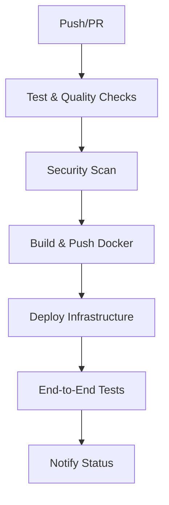

# Guia de Deployment - AWS Lambda Container API

Este documento fornece instruções detalhadas para deployar a aplicação AWS Lambda Container API na AWS usando Terraform e GitHub Actions.

## 📋 Índice

- [Pré-requisitos](#-pré-requisitos)
- [Configuração Inicial](#-configuração-inicial)
- [Deployment Manual](#-deployment-manual)
- [Deployment Automatizado (CI/CD)](#-deployment-automatizado-cicd)
- [Configuração de Credenciais AWS](#-configuração-de-credenciais-aws)
- [Troubleshooting](#-troubleshooting)
- [Rollback e Recuperação](#-rollback-e-recuperação)

## 🔧 Pré-requisitos

### Ferramentas Necessárias

- **AWS CLI** 2.0+ configurado
- **Terraform** 1.5.0+
- **Docker** 20.10+
- **Git** para controle de versão
- **Python** 3.11+ (para testes locais)

### Permissões AWS Necessárias

Sua conta AWS deve ter as seguintes permissões:

```json
{
  "Version": "2012-10-17",
  "Statement": [
    {
      "Effect": "Allow",
      "Action": [
        "ecr:*",
        "lambda:*",
        "apigateway:*",
        "iam:CreateRole",
        "iam:DeleteRole",
        "iam:AttachRolePolicy",
        "iam:DetachRolePolicy",
        "iam:PassRole",
        "logs:CreateLogGroup",
        "logs:DeleteLogGroup",
        "logs:PutRetentionPolicy",
        "s3:GetObject",
        "s3:PutObject",
        "s3:DeleteObject",
        "s3:ListBucket"
      ],
      "Resource": "*"
    }
  ]
}
```

### Recursos AWS Necessários

1. **Bucket S3** para estado do Terraform
2. **Repositório ECR** (será criado automaticamente)
3. **Credenciais AWS** configuradas

## ⚙️ Configuração Inicial

### 1. Configurar Backend do Terraform

Copie e configure o arquivo de backend:

```bash
cp terraform/backend.tf.example terraform/backend.tf
```

Edite `terraform/backend.tf`:

```hcl
terraform {
  backend "s3" {
    bucket         = "seu-bucket-terraform-state"
    key            = "lambda-container-api/terraform.tfstate"
    region         = "us-east-1"
    encrypt        = true
    dynamodb_table = "terraform-state-lock"  # Opcional, para locking
  }
}
```

### 2. Criar Bucket S3 para Estado

```bash
# Criar bucket para estado do Terraform
aws s3 mb s3://seu-bucket-terraform-state --region us-east-1

# Habilitar versionamento
aws s3api put-bucket-versioning \
  --bucket seu-bucket-terraform-state \
  --versioning-configuration Status=Enabled

# Habilitar criptografia
aws s3api put-bucket-encryption \
  --bucket seu-bucket-terraform-state \
  --server-side-encryption-configuration '{
    "Rules": [{
      "ApplyServerSideEncryptionByDefault": {
        "SSEAlgorithm": "AES256"
      }
    }]
  }'
```

### 3. Configurar Variáveis do Terraform

Copie e configure o arquivo de variáveis:

```bash
cp terraform/terraform.tfvars.example terraform/terraform.tfvars
```

Edite `terraform/terraform.tfvars`:

```hcl
# Configurações do projeto
project_name = "lambda-container-api"
environment  = "dev"  # ou "prod"
aws_region   = "us-east-1"

# Configurações da Lambda
lambda_memory_size = 512
lambda_timeout     = 30

# Tag da imagem ECR (será atualizada pelo CI/CD)
ecr_image_tag = "latest"

# Configurações de CORS
api_cors_allow_origins = ["*"]
api_cors_allow_methods = ["GET", "POST", "OPTIONS"]
api_cors_allow_headers = ["Content-Type", "X-Amz-Date", "Authorization", "X-Api-Key"]
```

## 🚀 Deployment Manual

### Passo 1: Build e Push da Imagem Docker

```bash
# 1. Configurar variáveis
export AWS_REGION=us-east-1
export ECR_REPOSITORY=lambda-container-api
export IMAGE_TAG=manual-$(date +%Y%m%d-%H%M%S)

# 2. Obter URL do repositório ECR
export ECR_REGISTRY=$(aws sts get-caller-identity --query Account --output text).dkr.ecr.${AWS_REGION}.amazonaws.com

# 3. Fazer login no ECR
aws ecr get-login-password --region ${AWS_REGION} | \
  docker login --username AWS --password-stdin ${ECR_REGISTRY}

# 4. Criar repositório ECR (se não existir)
aws ecr create-repository \
  --repository-name ${ECR_REPOSITORY} \
  --region ${AWS_REGION} \
  --image-scanning-configuration scanOnPush=true \
  --encryption-configuration encryptionType=AES256 || true

# 5. Build da imagem
docker build -t ${ECR_REPOSITORY}:${IMAGE_TAG} .

# 6. Tag para ECR
docker tag ${ECR_REPOSITORY}:${IMAGE_TAG} \
  ${ECR_REGISTRY}/${ECR_REPOSITORY}:${IMAGE_TAG}

# 7. Push para ECR
docker push ${ECR_REGISTRY}/${ECR_REPOSITORY}:${IMAGE_TAG}

echo "Imagem enviada: ${ECR_REGISTRY}/${ECR_REPOSITORY}:${IMAGE_TAG}"
```

### Passo 2: Deploy da Infraestrutura

```bash
cd terraform

# 1. Inicializar Terraform
terraform init

# 2. Validar configuração
terraform validate

# 3. Planejar deployment
terraform plan \
  -var="ecr_image_tag=${IMAGE_TAG}" \
  -out=tfplan

# 4. Revisar o plano
# Verifique se todos os recursos estão corretos

# 5. Aplicar mudanças
terraform apply tfplan

# 6. Obter outputs
terraform output
```

### Passo 3: Verificar Deployment

```bash
# Obter URL da API
API_URL=$(terraform output -raw api_gateway_url)

# Testar endpoint Hello
curl "${API_URL}/hello"

# Testar endpoint Echo
curl "${API_URL}/echo?msg=deployment-test"

# Verificar logs da Lambda
aws logs describe-log-groups --log-group-name-prefix "/aws/lambda/lambda-container-api"
```

## 🔄 Deployment Automatizado (CI/CD)

### Configuração do GitHub Actions

O projeto inclui um pipeline CI/CD completo que automatiza todo o processo de deployment.

#### Workflow Overview



#### Configuração de Secrets

Configure os seguintes secrets no GitHub:

1. **Acesse** Settings > Secrets and variables > Actions
2. **Adicione** os seguintes secrets:

```bash
# AWS OIDC Role ARN (recomendado)
AWS_ROLE_TO_ASSUME=arn:aws:iam::123456789012:role/GitHubActionsRole

# Bucket S3 para estado do Terraform
TERRAFORM_STATE_BUCKET=seu-bucket-terraform-state

# Opcionais (se não usar OIDC)
AWS_ACCESS_KEY_ID=AKIA...
AWS_SECRET_ACCESS_KEY=...
```

#### Configuração OIDC (Recomendado)

Para usar OIDC em vez de chaves de acesso:

```bash
# 1. Criar role IAM para GitHub Actions
aws iam create-role \
  --role-name GitHubActionsRole \
  --assume-role-policy-document '{
    "Version": "2012-10-17",
    "Statement": [
      {
        "Effect": "Allow",
        "Principal": {
          "Federated": "arn:aws:iam::123456789012:oidc-provider/token.actions.githubusercontent.com"
        },
        "Action": "sts:AssumeRoleWithWebIdentity",
        "Condition": {
          "StringEquals": {
            "token.actions.githubusercontent.com:aud": "sts.amazonaws.com"
          },
          "StringLike": {
            "token.actions.githubusercontent.com:sub": "repo:seu-usuario/seu-repositorio:*"
          }
        }
      }
    ]
  }'

# 2. Anexar políticas necessárias
aws iam attach-role-policy \
  --role-name GitHubActionsRole \
  --policy-arn arn:aws:iam::aws:policy/AmazonEC2ContainerRegistryFullAccess

aws iam attach-role-policy \
  --role-name GitHubActionsRole \
  --policy-arn arn:aws:iam::aws:policy/AWSLambda_FullAccess

# Adicionar outras políticas conforme necessário
```

### Trigger do Pipeline

O pipeline é executado automaticamente quando:

- **Push** para branches `main` ou `develop`
- **Pull Request** para branches `main` ou `develop`

### Monitoramento do Pipeline

1. **Acesse** a aba Actions no GitHub
2. **Selecione** o workflow "CI/CD Pipeline"
3. **Monitore** o progresso de cada job
4. **Verifique** os logs em caso de falha

## 🔐 Configuração de Credenciais AWS

### Método 1: AWS CLI (Desenvolvimento Local)

```bash
# Configurar perfil padrão
aws configure

# Ou configurar perfil específico
aws configure --profile lambda-api

# Verificar configuração
aws sts get-caller-identity
```

### Método 2: Variáveis de Ambiente

```bash
export AWS_ACCESS_KEY_ID=AKIA...
export AWS_SECRET_ACCESS_KEY=...
export AWS_DEFAULT_REGION=us-east-1
```

### Método 3: IAM Roles (EC2/Lambda)

Se executando em instância EC2 ou Lambda, use IAM Roles:

```bash
# Verificar role atual
curl http://169.254.169.254/latest/meta-data/iam/security-credentials/
```

### Método 4: AWS SSO

```bash
# Configurar SSO
aws configure sso

# Login
aws sso login --profile lambda-api
```

## 🔍 Troubleshooting

### Problemas Comuns

#### 1. Erro de Permissões AWS

**Sintoma**: `AccessDenied` ou `UnauthorizedOperation`

**Solução**:
```bash
# Verificar identidade atual
aws sts get-caller-identity

# Verificar permissões
aws iam simulate-principal-policy \
  --policy-source-arn $(aws sts get-caller-identity --query Arn --output text) \
  --action-names ecr:GetAuthorizationToken \
  --resource-arns "*"
```

#### 2. Terraform State Lock

**Sintoma**: `Error acquiring the state lock`

**Solução**:
```bash
# Forçar unlock (cuidado!)
terraform force-unlock <LOCK_ID>

# Ou verificar DynamoDB table
aws dynamodb scan --table-name terraform-state-lock
```

#### 3. ECR Repository Não Existe

**Sintoma**: `RepositoryNotFoundException`

**Solução**:
```bash
# Criar repositório manualmente
aws ecr create-repository \
  --repository-name lambda-container-api \
  --region us-east-1
```

#### 4. Docker Build Falha

**Sintoma**: Erro durante `docker build`

**Solução**:
```bash
# Verificar Dockerfile
docker build --no-cache -t test .

# Verificar espaço em disco
docker system df
docker system prune -f
```

#### 5. Lambda Function Timeout

**Sintoma**: `Task timed out after X seconds`

**Solução**:
```bash
# Aumentar timeout no Terraform
# Em terraform/terraform.tfvars
lambda_timeout = 60

# Ou via AWS CLI
aws lambda update-function-configuration \
  --function-name lambda-container-api-dev \
  --timeout 60
```

### Logs e Debugging

#### CloudWatch Logs

```bash
# Listar grupos de log
aws logs describe-log-groups --log-group-name-prefix "/aws/lambda"

# Ver logs recentes
aws logs tail /aws/lambda/lambda-container-api-dev --follow

# Filtrar logs por erro
aws logs filter-log-events \
  --log-group-name "/aws/lambda/lambda-container-api-dev" \
  --filter-pattern "ERROR"
```

#### Terraform Debug

```bash
# Habilitar debug do Terraform
export TF_LOG=DEBUG
terraform plan

# Ver estado atual
terraform show

# Listar recursos
terraform state list
```

#### Docker Debug

```bash
# Executar container localmente
docker run -it --entrypoint /bin/bash lambda-container-api

# Verificar logs do container
docker logs <container-id>

# Inspecionar imagem
docker inspect lambda-container-api
```

### Validação de Deployment

#### Checklist Pós-Deployment

- [ ] **API Gateway** responde corretamente
- [ ] **Lambda Function** executa sem erros
- [ ] **CloudWatch Logs** estão sendo gerados
- [ ] **ECR Repository** contém a imagem
- [ ] **Terraform State** está atualizado
- [ ] **Endpoints** retornam respostas esperadas

#### Scripts de Validação

```bash
#!/bin/bash
# validate-deployment.sh

API_URL=$(terraform output -raw api_gateway_url)

echo "Validando deployment..."

# Teste Hello endpoint
echo "Testando /hello..."
HELLO_RESPONSE=$(curl -s "${API_URL}/hello")
if echo "$HELLO_RESPONSE" | grep -q "Hello World"; then
  echo "✅ Hello endpoint OK"
else
  echo "❌ Hello endpoint FALHOU"
  echo "$HELLO_RESPONSE"
fi

# Teste Echo endpoint
echo "Testando /echo..."
ECHO_RESPONSE=$(curl -s "${API_URL}/echo?msg=test")
if echo "$ECHO_RESPONSE" | grep -q "test"; then
  echo "✅ Echo endpoint OK"
else
  echo "❌ Echo endpoint FALHOU"
  echo "$ECHO_RESPONSE"
fi

# Teste erro handling
echo "Testando error handling..."
ERROR_RESPONSE=$(curl -s "${API_URL}/echo")
if echo "$ERROR_RESPONSE" | grep -q "Parameter 'msg' is required"; then
  echo "✅ Error handling OK"
else
  echo "❌ Error handling FALHOU"
  echo "$ERROR_RESPONSE"
fi

echo "Validação concluída!"
```

## 🔄 Rollback e Recuperação

### Rollback Automático

O pipeline CI/CD inclui verificações que impedem deployments com falha:

1. **Testes** devem passar
2. **Security scan** deve ser limpo
3. **Terraform plan** deve ser válido
4. **End-to-end tests** devem passar

### Rollback Manual

#### Método 1: Terraform

```bash
# Ver histórico de estado
terraform state pull > current-state.json

# Reverter para versão anterior (se disponível)
terraform apply -target=aws_lambda_function.main \
  -var="ecr_image_tag=previous-tag"
```

#### Método 2: AWS Lambda Versions

```bash
# Listar versões da função
aws lambda list-versions-by-function \
  --function-name lambda-container-api-dev

# Reverter para versão anterior
aws lambda update-alias \
  --function-name lambda-container-api-dev \
  --name LIVE \
  --function-version 2
```

#### Método 3: ECR Image Rollback

```bash
# Listar tags disponíveis
aws ecr list-images \
  --repository-name lambda-container-api \
  --query 'imageIds[*].imageTag'

# Re-deploy com tag anterior
terraform apply -var="ecr_image_tag=previous-working-tag"
```

### Recuperação de Desastres

#### Backup do Estado

```bash
# Backup automático do estado S3
aws s3 sync s3://seu-bucket-terraform-state s3://backup-bucket/terraform-state/

# Backup local
terraform state pull > backup-$(date +%Y%m%d).tfstate
```

#### Recriação Completa

```bash
# Destruir infraestrutura
terraform destroy

# Recriar do zero
terraform apply
```

## 📊 Monitoramento Pós-Deployment

### Métricas Importantes

- **Lambda Duration**: Tempo de execução
- **Lambda Errors**: Taxa de erro
- **API Gateway 4xx/5xx**: Erros de cliente/servidor
- **ECR Image Pulls**: Uso da imagem

### Alertas Recomendados

```bash
# CloudWatch Alarm para erros Lambda
aws cloudwatch put-metric-alarm \
  --alarm-name "lambda-container-api-errors" \
  --alarm-description "Lambda function errors" \
  --metric-name Errors \
  --namespace AWS/Lambda \
  --statistic Sum \
  --period 300 \
  --threshold 5 \
  --comparison-operator GreaterThanThreshold \
  --dimensions Name=FunctionName,Value=lambda-container-api-dev
```

---

**Para mais informações, consulte:**
- [README.md](README.md) - Documentação geral
- [TESTING.md](TESTING.md) - Guia de testes
- [CI-CD.md](CI-CD.md) - Documentação do pipeline