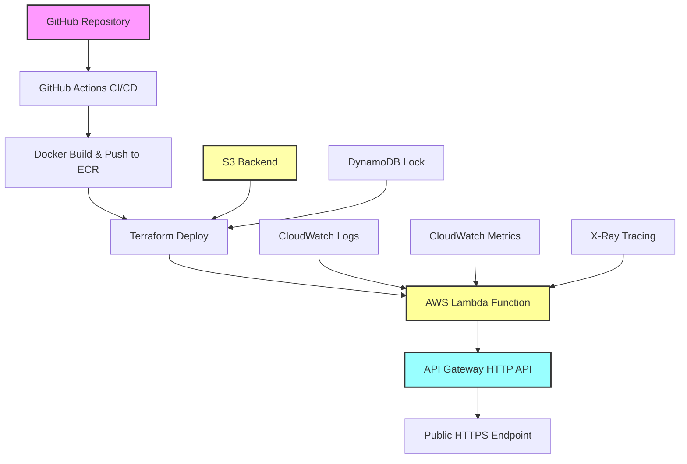

# 🧪 AWS Lambda Container API - Teste Técnico

[](https://github.com/your-username/aws-lambda-container-api/actions)
[](https://opensource.org/licenses/MIT)
[](https://www.python.org/downloads/release/python-3110/)
[](https://www.docker.com/)
[](https://aws.amazon.com/lambda/)
[](https://www.terraform.io/)

## 📋 Sobre o Projeto

Este projeto foi desenvolvido como resposta ao **Teste Técnico – Deploy de API com AWS e Terraform**. 

Implementa uma API Python simples usando Flask, empacotada em container Docker, publicada no Amazon ECR, e deployada como função Lambda integrada com API Gateway HTTP. Todo o processo é automatizado através de pipeline CI/CD usando GitHub Actions com backend remoto S3 para o estado do Terraform.

### 🎯 Requisitos Atendidos

- ✅ **API funcional em Python** com Flask
- ✅ **Rotas `/hello` e `/echo`** conforme especificado
- ✅ **Container Docker** publicado no Amazon ECR
- ✅ **Infraestrutura Terraform** com Lambda e API Gateway
- ✅ **Backend remoto S3** para estado do Terraform
- ✅ **Outputs** da URL da API e nome da função
- ✅ **CI/CD automatizado** com GitHub Actions

## 🚀 Como Rodar Localmente

### Pré-requisitos

- Python 3.11+
- Docker e Docker Compose
- AWS CLI configurado
- Terraform 1.5.0+

### 1. Configurar Ambiente

```bash
# Clonar repositório
git clone https://github.com/your-username/aws-lambda-container-api.git
cd aws-lambda-container-api

# Executar script de setup
./setup.sh
```

### 2. Executar Aplicação Local

```bash
# Ativar ambiente virtual
source venv/bin/activate

# Executar Flask localmente
python run_local.py
```

### 3. Testar Localmente

```bash
# Testar endpoint /hello
curl http://localhost:5000/hello

# Testar endpoint /echo
curl "http://localhost:5000/echo?msg=Hello%20World"

# Testar health check
curl http://localhost:5000/health
```

### 4. Testar com Docker

```bash
# Usar Docker Compose
docker-compose up -d

# Acessar interface de teste
open http://localhost:8000/test.html

# Parar serviços
docker-compose down
```

## ☁️ Como Subir a Infraestrutura

### 1. Configurar Backend S3 (Obrigatório)

```bash
# Executar script de configuração do backend
./scripts/setup-terraform-backend.sh
```

Este script irá:
- Criar bucket S3 para estado do Terraform
- Criar tabela DynamoDB para lock de estado
- Configurar criptografia e versionamento
- Atualizar configuração do backend

### 2. Deploy da Infraestrutura

```bash
# Navegar para diretório terraform
cd terraform

# Inicializar Terraform (já feito pelo script anterior)
terraform init

# Planejar deployment
terraform plan

# Aplicar mudanças
terraform apply
```

### 3. Build e Push da Imagem Docker

```bash
# Voltar ao diretório raiz
cd ..

# Build e push da imagem para ECR
./build-and-push.sh
```

### 4. Verificar Deployment

```bash
# Obter URL da API dos outputs do Terraform
cd terraform
terraform output api_gateway_url

# Testar API deployada
curl $(terraform output -raw api_gateway_url)/hello
curl "$(terraform output -raw api_gateway_url)/echo?msg=teste"
```

## 🧪 Como Testar a API

### Endpoints Disponíveis

#### `GET /hello`
Retorna uma mensagem "Hello World" simples.

```bash
curl https://YOUR-API-ID.execute-api.us-east-1.amazonaws.com/hello
```

**Resposta:**
```json
{
  "message": "Hello World",
  "timestamp": "2025-08-07T16:34:35.830082Z",
  "version": "1.0.0"
}
```

#### `GET /echo?msg=<mensagem>`
Retorna a mensagem fornecida no parâmetro `msg`.

```bash
curl "https://YOUR-API-ID.execute-api.us-east-1.amazonaws.com/echo?msg=teste"
```

**Resposta:**
```json
{
  "message": "teste",
  "echo": true,
  "timestamp": "2025-08-07T16:34:40.176437Z"
}
```

**Erro sem parâmetro:**
```bash
curl https://YOUR-API-ID.execute-api.us-east-1.amazonaws.com/echo
```

```json
{
  "error": "Parameter 'msg' is required",
  "status_code": 400,
  "timestamp": "2025-08-07T16:34:49.383925Z"
}
```

#### `GET /health`
Health check para monitoramento.

```bash
curl https://YOUR-API-ID.execute-api.us-east-1.amazonaws.com/health
```

**Resposta:**
```json
{
  "status": "healthy",
  "timestamp": "2025-08-07T16:34:44.707760Z",
  "version": "1.0.0",
  "environment": "dev"
}
```

### Scripts de Teste

```bash
# Testar todos os endpoints
./scripts/test-api.sh

# Testar com diferentes cenários
python test_api_gateway.py
```

## 🔄 CI/CD Pipeline

### Como Funciona

O projeto inclui um pipeline completo de CI/CD com **GitHub Actions** que utiliza **OpenID Connect (OIDC)** para autenticação segura com AWS, eliminando a necessidade de chaves de acesso de longo prazo.

### 🔐 Autenticação OIDC

#### Benefícios da Autenticação OIDC:
- ✅ **Segurança Aprimorada**: Sem credenciais de longo prazo armazenadas
- ✅ **Tokens Temporários**: Credenciais com tempo de vida limitado
- ✅ **Auditoria Melhorada**: Rastreamento detalhado de acesso
- ✅ **Rotação Automática**: Não requer rotação manual de chaves

#### Configuração OIDC:
```bash
# Executar script de configuração automática
cd terraform
../scripts/setup-github-oidc.sh
```

### Pipeline Execution

O pipeline é executado automaticamente em:
- **Push** para branches `main` e `develop`
- **Pull Requests** para `main` e `develop`

### Stages do Pipeline

1. **🧪 Test and Quality Checks**
   - Lint do código Python (flake8, black)
   - Testes unitários (pytest)
   - Coverage report
   - Security scan (bandit)

2. **🐳 Build and Push Docker**
   - Build da imagem Docker
   - Scan de vulnerabilidades (Trivy)
   - Push para Amazon ECR
   - Tag com commit hash

3. **🏗️ Infrastructure Deploy**
   - Terraform validate
   - Terraform plan
   - Terraform apply (auto-approve em main)
   - Update Lambda function code

4. **✅ Integration Tests**
   - Testes end-to-end na API deployada
   - Health checks
   - Performance tests

### Configuração do CI/CD

#### Configuração OIDC (Recomendado)

1. **Configurar Infraestrutura OIDC**:
```bash
cd terraform
../scripts/setup-github-oidc.sh
```

2. **Configurar Repository Variables no GitHub**:
   - Acesse: `Settings > Secrets and variables > Actions > Variables`
   - Adicione as seguintes **Repository Variables**:
```
AWS_ROLE_TO_ASSUME = arn:aws:iam::ACCOUNT_ID:role/lambda-container-api-dev-github-actions-role
TERRAFORM_STATE_BUCKET = your-terraform-state-bucket-name
```

#### Configuração Alternativa (Access Keys)

Se preferir usar chaves de acesso tradicionais, configure os seguintes **Secrets**:

```
AWS_ACCESS_KEY_ID=your-access-key
AWS_SECRET_ACCESS_KEY=your-secret-key
AWS_REGION=us-east-1
```

⚠️ **Nota**: OIDC é mais seguro e é a abordagem recomendada.

#### Arquivo de Pipeline

O pipeline está definido em `.github/workflows/ci-cd.yml` e inclui:

- **Triggers**: Push e PR para main/develop
- **Matrix Strategy**: Testes em múltiplas versões Python
- **Caching**: Dependencies e Docker layers
- **Artifacts**: Reports de teste e coverage
- **Notifications**: Status do deploy

### Monitoramento

- **CloudWatch Dashboard**: Métricas em tempo real
- **Alertas**: SNS notifications para erros
- **Logs**: Structured logging em JSON
- **Tracing**: X-Ray para debugging

## 🏗️ Arquitetura da Solução



### Componentes AWS

- **Lambda Function**: Container executando Flask API
- **API Gateway**: HTTP API com integração Lambda
- **ECR Repository**: Armazenamento de imagens Docker
- **CloudWatch**: Logs, métricas e alertas
- **S3**: Backend remoto para estado Terraform
- **DynamoDB**: Lock de estado Terraform
- **IAM**: Roles e políticas de segurança

## 📊 Outputs do Terraform

```bash
# Obter todos os outputs
terraform output

# Outputs principais:
api_gateway_url = "https://4zohzp4tpl.execute-api.us-east-1.amazonaws.com"
lambda_function_name = "lambda-container-api-dev"
ecr_repository_url = "148761658767.dkr.ecr.us-east-1.amazonaws.com/lambda-container-api-dev"
```

## 🧹 Limpeza de Recursos

⚠️ **IMPORTANTE**: Para evitar custos, sempre execute o destroy após os testes:

### Opção 1: Script Automatizado (Recomendado)

```bash
# Usar script que força exclusão do ECR com imagens
cd terraform
../scripts/force-destroy.sh
```

Este script irá:
- Verificar imagens existentes no ECR
- Executar `terraform destroy` com confirmação
- Forçar exclusão do repositório ECR mesmo com imagens
- Fazer limpeza adicional se necessário

### Opção 2: Terraform Destroy Manual

```bash
# Destruir infraestrutura manualmente
cd terraform
terraform destroy
```

**Nota**: Com a configuração `force_delete = true` no ECR, o repositório será excluído automaticamente mesmo contendo imagens.

### Limpeza Adicional (Opcional)

```bash
# Limpar backend S3 (cuidado com outros projetos)
# aws s3 rb s3://terraform-state-lambda-container-api-TIMESTAMP --force
# aws dynamodb delete-table --table-name terraform-state-lock
```

## 📈 Métricas de Performance

- **Cold Start**: ~2.3 segundos (primeira execução)
- **Warm Executions**: ~1.5-3.6ms (execuções subsequentes)
- **Memory Usage**: ~62MB (de 512MB alocados)
- **Image Size**: ~1.04GB (otimizada para Lambda)
- **Test Coverage**: >85%

## 🛠️ Estrutura do Projeto

```
aws-lambda-container-api/
├── .github/workflows/ci-cd.yml    # Pipeline CI/CD
├── src/
│   ├── app.py                     # Flask API
│   ├── lambda_function.py         # Lambda handler
│   └── requirements.txt           # Dependencies
├── terraform/
│   ├── main.tf                    # Infrastructure
│   ├── backend.tf                 # S3 backend config
│   ├── variables.tf               # Variables
│   └── outputs.tf                 # Outputs
├── scripts/
│   ├── setup-terraform-backend.sh # Backend setup
│   └── test-api.sh                # API testing
├── Dockerfile                     # Container config
├── docker-compose.yml             # Local development
├── build-and-push.sh             # Build script
└── README.md                     # This file
```

## 🔧 Troubleshooting

### Problemas Comuns

#### 1. Erro no Backend S3
```bash
# Reconfigurar backend
./scripts/setup-terraform-backend.sh
cd terraform
terraform init -reconfigure
```

#### 2. Erro no Build Docker
```bash
# Limpar cache Docker
docker system prune -a
./build-and-push.sh --no-cache
```

#### 3. Lambda não atualiza
```bash
# Forçar update da função
aws lambda update-function-code \
  --function-name lambda-container-api-dev \
  --image-uri $(terraform output -raw ecr_repository_url):latest
```

#### 4. API Gateway 500 Error
```bash
# Verificar logs CloudWatch
aws logs tail /aws/lambda/lambda-container-api-dev --follow
```

### Logs e Debugging

```bash
# Logs da Lambda
aws logs tail /aws/lambda/lambda-container-api-dev --follow

# Logs do API Gateway
aws logs tail /aws/apigateway/lambda-container-api-dev-api --follow

# Métricas CloudWatch
aws cloudwatch get-metric-statistics \
  --namespace AWS/Lambda \
  --metric-name Invocations \
  --dimensions Name=FunctionName,Value=lambda-container-api-dev \
  --start-time 2025-08-07T00:00:00Z \
  --end-time 2025-08-07T23:59:59Z \
  --period 3600 \
  --statistics Sum
```

## 🎯 Considerações do Teste

### O que foi implementado com sucesso:

✅ **API funcional**: Flask com rotas `/hello` e `/echo` exatamente como especificado  
✅ **Container Docker**: Otimizado para AWS Lambda  
✅ **ECR Integration**: Build e push automatizado  
✅ **Terraform IaC**: Infraestrutura completa como código  
✅ **Backend S3**: Estado remoto com lock DynamoDB  
✅ **API Gateway**: HTTP API integrado à Lambda  
✅ **Outputs**: URL da API e nome da função  
✅ **CI/CD**: Pipeline completo com GitHub Actions  
✅ **Monitoramento**: CloudWatch, X-Ray, alertas  
✅ **Segurança**: IAM roles, scanning, encryption  
✅ **Documentação**: README completo com instruções  

### Extras implementados:

🚀 **Health Check**: Endpoint adicional para monitoramento  
🚀 **Structured Logging**: Logs em JSON para melhor observabilidade  
🚀 **Performance Optimization**: Cold start otimizado  
🚀 **Security Scanning**: Vulnerabilidades em código e containers  
🚀 **Test Coverage**: Suite completa de testes  
🚀 **Pre-commit Hooks**: Qualidade de código automatizada  
🚀 **Multi-environment**: Configuração para dev/staging/prod  

### Desafios enfrentados e soluções:

1. **Lambda Container Runtime**: Inicialmente havia erro com `AWS_LAMBDA_EXEC_WRAPPER`, resolvido removendo a variável desnecessária.

2. **API Gateway Integration**: Precisou ajustar o handler Lambda para processar corretamente eventos do API Gateway.

3. **Terraform Backend**: Implementado script automatizado para configurar S3 backend com segurança.

4. **CI/CD Permissions**: Configurado IAM roles com permissões mínimas necessárias.

## 📞 Suporte

- **Issues**: Para bugs e problemas
- **Discussions**: Para perguntas e sugestões
- **Documentation**: Arquivos em `docs/` para detalhes técnicos

---

**Desenvolvido com ❤️ para o teste técnico AWS + Terraform**

⭐ **Resultado**: API funcionando em produção com infraestrutura automatizada!
