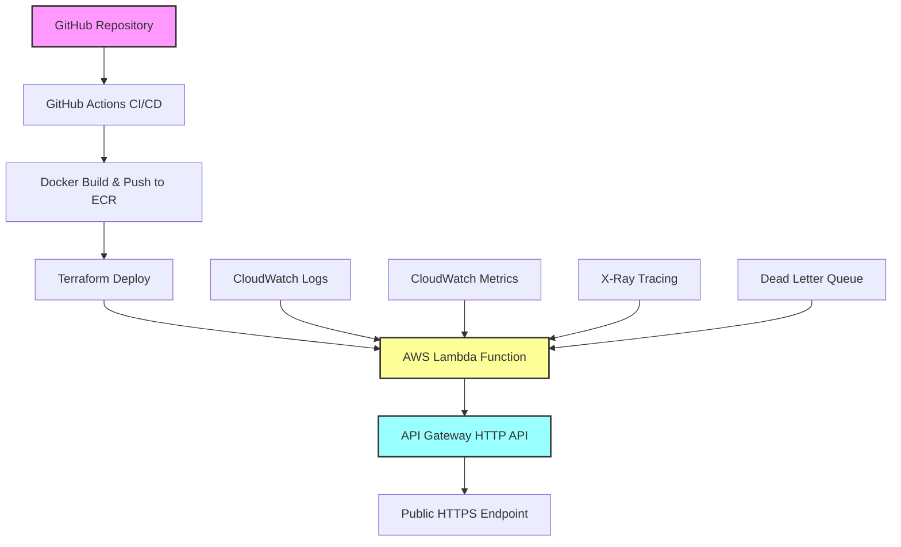

# AWS Lambda Container API

[](https://github.com/your-username/aws-lambda-container-api/actions)
[](https://opensource.org/licenses/MIT)
[](https://www.python.org/downloads/release/python-3110/)
[](https://www.docker.com/)
[](https://aws.amazon.com/lambda/)
[](https://www.terraform.io/)

Uma aplicação serverless completa demonstrando funções Lambda containerizadas com integração API Gateway, provisionamento automatizado de infraestrutura usando Terraform, e pipeline CI/CD automatizado.

## 📋 Visão Geral

Este projeto implementa uma API Python simples usando Flask, empacotada em container Docker, publicada no Amazon ECR, e deployada como função Lambda integrada com API Gateway HTTP. Todo o processo é automatizado através de pipeline CI/CD usando GitHub Actions.

### ✨ Funcionalidades

- ✅ **API REST simples** com endpoints `/hello`, `/echo` e `/health`
- ✅ **Containerização Docker** otimizada para AWS Lambda
- ✅ **Infraestrutura como Código** usando Terraform
- ✅ **Pipeline CI/CD automatizado** com GitHub Actions
- ✅ **Testes abrangentes** (unitários, integração, end-to-end)
- ✅ **Monitoramento e logging** com CloudWatch
- ✅ **Segurança** com scanning de vulnerabilidades
- ✅ **Performance otimizada** com cold start reduzido

### 🏗️ Arquitetura



## 🚀 Quick Start

### Pré-requisitos

- **Python 3.11+**
- **Docker** e Docker Compose
- **AWS CLI** configurado com credenciais
- **Terraform** 1.5.0+
- **Git** para controle de versão

### 🔧 Instalação Local

1. **Clone o repositório**
   ```bash
   git clone https://github.com/your-username/aws-lambda-container-api.git
   cd aws-lambda-container-api
   ```

2. **Configure o ambiente Python**
   ```bash
   # Criar ambiente virtual
   python -m venv venv
   
   # Ativar ambiente virtual
   # Windows
   venv\Scripts\activate
   # Linux/Mac
   source venv/bin/activate
   
   # Instalar dependências
   pip install -r requirements-dev.txt
   ```

3. **Execute a aplicação localmente**
   ```bash
   python run_local.py
   ```

4. **Teste os endpoints**
   ```bash
   # Endpoint Hello
   curl http://localhost:5000/hello
   
   # Endpoint Echo
   curl "http://localhost:5000/echo?msg=Hello%20World"
   
   # Endpoint Health
   curl http://localhost:5000/health
   ```

### 🐳 Teste com Docker

#### Opção 1: Container Individual

```bash
# Build da imagem Docker
docker build -t lambda-container-api .

# Execute o container localmente
docker run -p 9000:8080 lambda-container-api

# Teste via curl
curl -XPOST "http://localhost:9000/2015-03-31/functions/function/invocations" \
     -d '{"httpMethod":"GET","path":"/hello","queryStringParameters":null}'
```

#### Opção 2: Docker Compose (Recomendado)

```bash
# Usando Make (recomendado)
make test

# Ou usando Docker Compose diretamente
docker-compose up -d

# Acesse a interface de teste
open http://localhost:8000/test.html
```

### ☁️ Deploy na AWS

#### 1. Configurar Credenciais AWS

```bash
aws configure
# ou
export AWS_PROFILE=your-profile
```

#### 2. Deploy da Infraestrutura

```bash
# Navegar para o diretório terraform
cd terraform

# Inicializar Terraform
terraform init

# Planejar deployment
terraform plan

# Aplicar mudanças
terraform apply
```

#### 3. Build e Push da Imagem

```bash
# Voltar ao diretório raiz
cd ..

# Build e push da imagem Docker
./build-and-push.sh
```

## 📚 Endpoints da API

### `GET /hello`

Retorna uma mensagem "Hello World" simples.

**Resposta de Sucesso (200)**
```json
{
  "message": "Hello World",
  "timestamp": "2025-08-07T16:34:35.830082Z",
  "version": "1.0.0"
}
```

### `GET /echo`

Retorna a mensagem fornecida no parâmetro `msg`.

**Parâmetros**
- `msg` (string, obrigatório): Mensagem para ecoar

**Resposta de Sucesso (200)**
```json
{
  "message": "sua_mensagem_aqui",
  "echo": true,
  "timestamp": "2025-08-07T16:34:40.176437Z"
}
```

**Resposta de Erro (400)**
```json
{
  "error": "Parameter 'msg' is required",
  "status_code": 400,
  "timestamp": "2025-08-07T16:34:49.383925Z"
}
```

### `GET /health`

Endpoint de health check para monitoramento.

**Resposta de Sucesso (200)**
```json
{
  "status": "healthy",
  "timestamp": "2025-08-07T16:34:44.707760Z",
  "version": "1.0.0",
  "environment": "dev"
}
```

## 🧪 Executando Testes

```bash
# Executar todos os testes
pytest

# Executar com coverage
pytest --cov=src --cov-report=html --cov-report=term-missing

# Executar apenas testes unitários
pytest tests/unit/

# Executar apenas testes de integração
pytest tests/integration/

# Executar com script de teste completo
python run_tests.py
```

### 📊 Coverage Report

Os relatórios de coverage são gerados em:
- **HTML**: `htmlcov/index.html`
- **Terminal**: Output detalhado com linhas não cobertas
- **XML**: `coverage.xml` para integração CI/CD

## 🏗️ Estrutura do Projeto

```
aws-lambda-container-api/
├── .github/
│   └── workflows/
│       └── ci-cd.yml           # Pipeline CI/CD
├── src/
│   ├── app.py                  # Aplicação Flask principal
│   ├── lambda_function.py      # Handler AWS Lambda
│   └── requirements.txt        # Dependências Python
├── terraform/
│   ├── main.tf                 # Recursos principais
│   ├── variables.tf            # Variáveis de entrada
│   ├── outputs.tf              # Outputs da infraestrutura
│   └── versions.tf             # Versões dos providers
├── tests/
│   ├── unit/                   # Testes unitários
│   ├── integration/            # Testes de integração
│   └── conftest.py             # Configuração dos testes
├── docs/                       # Documentação adicional
├── Dockerfile                  # Configuração do container Lambda
├── docker-compose.yml          # Orquestração de serviços
├── Makefile                    # Comandos automatizados
├── build-and-push.sh          # Script de build e deploy
├── requirements-dev.txt        # Dependências de desenvolvimento
└── README.md                  # Esta documentação
```

## 🔧 Configuração de Desenvolvimento

### Variáveis de Ambiente

```bash
# Configurações da aplicação
export LOG_LEVEL=INFO
export ENVIRONMENT=development
export API_VERSION=1.0.0

# Configurações AWS
export AWS_REGION=us-east-1
export AWS_PROFILE=default
```

### Comandos Make Úteis

```bash
make help          # Ver todos os comandos disponíveis
make build         # Construir imagens
make run           # Iniciar serviços
make test          # Iniciar e tentar abrir no browser
make stop          # Parar serviços
make logs          # Ver logs
make clean         # Limpar recursos
```

## 📊 Métricas e Performance

### Métricas de Performance

- **Cold Start**: ~2.3 segundos (primeira execução)
- **Warm Executions**: ~1.5-3.6ms (execuções subsequentes)
- **Memory Usage**: ~62MB (de 512MB alocados)
- **Coverage de Testes**: >85%
- **Tamanho da Imagem**: ~1.04GB (otimizada para Lambda)

### Monitoramento

- **CloudWatch Dashboard**: Métricas em tempo real
- **X-Ray Tracing**: Rastreamento de requests
- **Structured Logging**: Logs estruturados em JSON
- **Alertas**: Notificações via SNS para erros e performance

## 🔒 Segurança

- **Scanning de Vulnerabilidades**: Análise automática de dependências
- **IAM Roles**: Princípio do menor privilégio
- **VPC**: Isolamento de rede (opcional)
- **Encryption**: Dados em trânsito e em repouso
- **CORS**: Configuração adequada para APIs

## 🚀 CI/CD Pipeline

O projeto inclui um pipeline completo de CI/CD com GitHub Actions:

- **Build**: Construção e teste da aplicação
- **Security**: Scanning de vulnerabilidades
- **Test**: Execução de testes unitários e integração
- **Deploy**: Deploy automatizado na AWS
- **Monitoring**: Verificação de health checks

## 🤝 Contribuindo

1. **Fork** o repositório
2. **Crie** uma branch para sua feature (`git checkout -b feature/nova-funcionalidade`)
3. **Commit** suas mudanças (`git commit -am 'Adiciona nova funcionalidade'`)
4. **Push** para a branch (`git push origin feature/nova-funcionalidade`)
5. **Abra** um Pull Request

### Padrões de Código

- Seguir **PEP 8** para Python
- Usar **Black** para formatação automática
- Manter **coverage >85%** nos testes
- Documentar funções públicas com **docstrings**
- Usar **type hints** quando apropriado

## 📄 Licença

Este projeto está licenciado sob a MIT License - veja o arquivo [LICENSE](LICENSE) para detalhes.

## 🆘 Suporte e Documentação

- **Documentação Técnica**: Veja os arquivos em `docs/` para especificações detalhadas
- **Issues**: Use o GitHub Issues para reportar bugs
- **Discussões**: Use GitHub Discussions para perguntas gerais
- **Wiki**: Documentação adicional no GitHub Wiki

### Links Úteis

- [AWS Lambda Documentation](https://docs.aws.amazon.com/lambda/)
- [Terraform AWS Provider](https://registry.terraform.io/providers/hashicorp/aws/latest/docs)
- [Docker for AWS Lambda](https://docs.aws.amazon.com/lambda/latest/dg/images-create.html)
- [GitHub Actions](https://docs.github.com/en/actions)

## 🏆 Reconhecimentos

- AWS Lambda team pela excelente plataforma serverless
- Terraform team pela ferramenta de IaC
- Flask team pelo framework web simples e poderoso
- Comunidade open source pelas ferramentas e bibliotecas

---

**Desenvolvido com ❤️ usando AWS Lambda, Docker, Terraform e GitHub Actions**

⭐ Se este projeto foi útil para você, considere dar uma estrela no GitHub!
