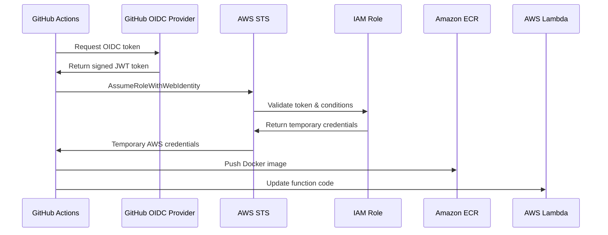

# Migração para GitHub OIDC

## 📋 Visão Geral

Este documento descreve como migrar de chaves de acesso AWS (Access Keys) para OpenID Connect (OIDC) no GitHub Actions, proporcionando maior segurança e eliminando a necessidade de armazenar credenciais de longo prazo.

## 🔐 Benefícios do OIDC

### Segurança Aprimorada
- ✅ **Sem credenciais de longo prazo**: Elimina chaves de acesso armazenadas
- ✅ **Tokens temporários**: Credenciais com tempo de vida limitado
- ✅ **Princípio do menor privilégio**: Permissões específicas por repositório
- ✅ **Auditoria melhorada**: Rastreamento detalhado de acesso

### Operacional
- ✅ **Rotação automática**: Não requer rotação manual de chaves
- ✅ **Gestão centralizada**: Controle via IAM roles
- ✅ **Compliance**: Atende requisitos de segurança corporativa

## 🔄 Processo de Migração

### Passo 1: Configurar Infraestrutura OIDC

#### 1.1 Executar Script de Configuração
```bash
cd terraform
../scripts/setup-github-oidc.sh
```

O script irá:
- Criar o OIDC Identity Provider
- Configurar IAM Role para GitHub Actions
- Definir políticas de permissão necessárias
- Gerar outputs com informações importantes

#### 1.2 Configuração Manual (Alternativa)
```bash
cd terraform

# Definir variáveis
export GITHUB_REPOSITORY="your-username/aws-lambda-container-api"
export TERRAFORM_STATE_BUCKET="your-terraform-state-bucket"

# Aplicar configuração
terraform plan -var="github_repository=$GITHUB_REPOSITORY" \
               -var="terraform_state_bucket=$TERRAFORM_STATE_BUCKET"
terraform apply
```

### Passo 2: Configurar GitHub Repository

#### 2.1 Obter Role ARN
```bash
cd terraform
terraform output github_actions_role_arn
```

#### 2.2 Configurar Repository Variables
Acesse: `https://github.com/YOUR_USERNAME/YOUR_REPO/settings/variables/actions`

Adicione as seguintes **Repository Variables**:
```
AWS_ROLE_TO_ASSUME = arn:aws:iam::ACCOUNT_ID:role/lambda-container-api-dev-github-actions-role
TERRAFORM_STATE_BUCKET = your-terraform-state-bucket-name
```

⚠️ **IMPORTANTE**: Use **Variables**, não **Secrets** para estes valores.

#### 2.3 Remover Secrets Antigos (Opcional)
Após confirmar que o OIDC funciona, remova:
- `AWS_ACCESS_KEY_ID`
- `AWS_SECRET_ACCESS_KEY`

### Passo 3: Testar Pipeline

#### 3.1 Executar Pipeline
```bash
git add .
git commit -m "Configure GitHub OIDC authentication"
git push origin main
```

#### 3.2 Monitorar Execução
- Acesse: `https://github.com/YOUR_USERNAME/YOUR_REPO/actions`
- Verifique se os jobs executam sem erros de autenticação
- Confirme que os recursos AWS são acessados corretamente

## 🏗️ Arquitetura OIDC



## 🔧 Configuração Detalhada

### IAM Role Trust Policy
```json
{
  "Version": "2012-10-17",
  "Statement": [
    {
      "Effect": "Allow",
      "Principal": {
        "Federated": "arn:aws:iam::ACCOUNT_ID:oidc-provider/token.actions.githubusercontent.com"
      },
      "Action": "sts:AssumeRoleWithWebIdentity",
      "Condition": {
        "StringEquals": {
          "token.actions.githubusercontent.com:aud": "sts.amazonaws.com"
        },
        "StringLike": {
          "token.actions.githubusercontent.com:sub": [
            "repo:owner/repo:ref:refs/heads/main",
            "repo:owner/repo:ref:refs/heads/develop",
            "repo:owner/repo:pull_request"
          ]
        }
      }
    }
  ]
}
```

### GitHub Actions Workflow
```yaml
- name: Configure AWS credentials using OIDC
  uses: aws-actions/configure-aws-credentials@v4
  with:
    role-to-assume: ${{ vars.AWS_ROLE_TO_ASSUME }}
    aws-region: ${{ env.AWS_REGION }}
    role-session-name: GitHubActions-${{ github.run_id }}
```

## 🔍 Troubleshooting

### Erro: "No OpenIDConnect provider found"
**Causa**: OIDC Provider não foi criado ou configurado incorretamente.

**Solução**:
```bash
# Verificar se o provider existe
aws iam list-open-id-connect-providers

# Recriar se necessário
cd terraform
terraform apply -target=aws_iam_openid_connect_provider.github
```

### Erro: "Not authorized to perform sts:AssumeRoleWithWebIdentity"
**Causa**: Trust policy da role não permite o repositório/branch.

**Solução**:
1. Verificar se o nome do repositório está correto na trust policy
2. Confirmar se o branch está listado nas condições
3. Verificar se a variável `AWS_ROLE_TO_ASSUME` está correta

### Erro: "Access Denied" em operações AWS
**Causa**: Role não tem permissões suficientes.

**Solução**:
```bash
# Verificar políticas da role
aws iam list-attached-role-policies --role-name lambda-container-api-dev-github-actions-role
aws iam list-role-policies --role-name lambda-container-api-dev-github-actions-role

# Aplicar políticas atualizadas
cd terraform
terraform apply -target=aws_iam_role_policy.github_actions_ecr
terraform apply -target=aws_iam_role_policy.github_actions_lambda
```

### Erro: "Token audience validation failed"
**Causa**: Configuração incorreta do audience no OIDC.

**Solução**:
Verificar se o audience está configurado como `sts.amazonaws.com`:
```bash
aws iam get-open-id-connect-provider --open-id-connect-provider-arn PROVIDER_ARN
```

## 📊 Comparação: Antes vs Depois

| Aspecto | Access Keys | OIDC |
|---------|-------------|------|
| **Segurança** | ❌ Credenciais permanentes | ✅ Tokens temporários |
| **Rotação** | ❌ Manual | ✅ Automática |
| **Auditoria** | ⚠️ Limitada | ✅ Detalhada |
| **Compliance** | ❌ Não recomendado | ✅ Best practice |
| **Gestão** | ❌ Complexa | ✅ Centralizada |
| **Risco** | ❌ Alto (vazamento) | ✅ Baixo |

## 🎯 Validação da Migração

### Checklist de Verificação
- [ ] OIDC Provider criado no AWS IAM
- [ ] IAM Role configurada com trust policy correto
- [ ] Políticas de permissão aplicadas à role
- [ ] Repository Variables configuradas no GitHub
- [ ] Pipeline executa sem erros de autenticação
- [ ] Recursos AWS são acessados corretamente
- [ ] Secrets antigos removidos (opcional)

### Testes de Validação
```bash
# 1. Verificar outputs do Terraform
cd terraform
terraform output github_actions_role_arn
terraform output github_oidc_provider_arn

# 2. Testar pipeline
git push origin main

# 3. Verificar logs do CloudWatch
aws logs tail /aws/lambda/lambda-container-api-dev --follow
```

## 🔄 Rollback (Se Necessário)

### Reverter para Access Keys
1. Reconfigurar secrets no GitHub:
   ```
   AWS_ACCESS_KEY_ID = your-access-key
   AWS_SECRET_ACCESS_KEY = your-secret-key
   ```

2. Reverter workflow para usar secrets:
   ```yaml
   - name: Configure AWS credentials
     uses: aws-actions/configure-aws-credentials@v4
     with:
       aws-access-key-id: ${{ secrets.AWS_ACCESS_KEY_ID }}
       aws-secret-access-key: ${{ secrets.AWS_SECRET_ACCESS_KEY }}
       aws-region: ${{ env.AWS_REGION }}
   ```

3. Remover recursos OIDC (opcional):
   ```bash
   terraform destroy -target=aws_iam_role.github_actions
   terraform destroy -target=aws_iam_openid_connect_provider.github
   ```

## 📚 Referências

- [GitHub OIDC Documentation](https://docs.github.com/en/actions/deployment/security-hardening-your-deployments/about-security-hardening-with-openid-connect)
- [AWS IAM OIDC Documentation](https://docs.aws.amazon.com/IAM/latest/UserGuide/id_roles_providers_create_oidc.html)
- [aws-actions/configure-aws-credentials](https://github.com/aws-actions/configure-aws-credentials)

## 🆘 Suporte

Em caso de problemas:
1. Verificar logs do GitHub Actions
2. Consultar CloudWatch logs da Lambda
3. Validar configuração IAM no AWS Console
4. Revisar trust policy da role
5. Confirmar variáveis do repositório GitHub
